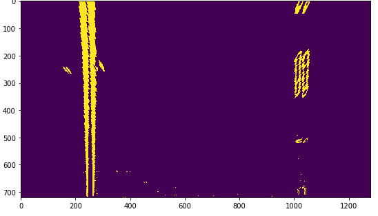
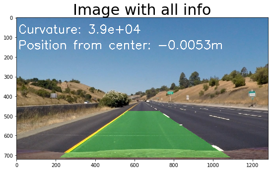

## Writeup
---

**Advanced Lane Finding Project**

The goals / steps of this project are the following:

* Compute the camera calibration matrix and distortion coefficients given a set of chessboard images.
* Apply a distortion correction to raw images.
* Use color transforms, gradients, etc., to create a thresholded binary image.
* Apply a perspective transform to rectify binary image ("birds-eye view").
* Detect lane pixels and fit to find the lane boundary.
* Determine the curvature of the lane and vehicle position with respect to center.
* Warp the detected lane boundaries back onto the original image.
* Output visual display of the lane boundaries and numerical estimation of lane curvature and vehicle position.


## [Rubric](https://review.udacity.com/#!/rubrics/571/view) Points

### Rubric points

---

### Writeup / README

### Camera Calibration

#### 1. Camera matrix and distortion coefficients.

The code for this step can be found in `morph_img.py`.
`get_obj_img_points` (lines 22-47) tries to find the image coordinates in each calibration image.
The corresponding object points are then aligned in a different list.

`get_calibration` (lines 50-54) uses these lists to calculate the variables necessary to undistort a picture, making use of
opencv's `calibrateCamera` and `undistort`.

Below are an example of a distorted and undistorted image:


### Pipeline (single images)

#### 1. Distortion-correction

Pictures and explanation shown above.

#### 2. Thresholded binary image

I used sobel x to calculate the gradient in the x direction, and used a threshold to transform it into a binary image.

Below is an example of an image before and after thresholded sobel x.


#### 3. Perspective transform

I wrote two functions `warp_to_birds_eye` and `warp_from_birds_eye` (lines 88 - 93)
 to respectively transform an image to and from birds eye view.

I calculated the transform matrix by handpicking coordinates. The following coordinates (shown within the function) are used:
```
def get_M_and_minv():
    src_coords = np.array([
        [540, 490],
        [748, 490],
        [260, 680],
        [1045, 680]
    ], dtype=np.float32)
    dst_coords = np.array([
        [250, 200],
        [1030, 200],
        [250, 700],
        [1030, 700]
    ], dtype=np.float32)

    M = cv2.getPerspectiveTransform(src_coords, dst_coords)
    Minv = cv2.getPerspectiveTransform(dst_coords, src_coords)

    return M, Minv
 ```

I verified that my perspective transform was working by looking at different images before and after warping.
Below is an example of a picture before and after warping. The blue dots on the image show where each point was warped to.
Note that these are distorted pictures (no undistort was called).


#### 4. Lane line pixels
First I split the image in half, using only the bottom half of the image.
Then I used a histogram, summing pixel values for each column, to detect where the most activated pixels from sobel x where located on the x-axis.

An example image and the corresponding histogram is shown below:




Then I split the histogram in half and extracted the peak from both the left and the right side.

The locations of the highest peaks are used as origin points for the lanes.


After this, a window is created with preset width and height for both the left and right lane (liens 92 164).
Note that the visualisation part is left out in this code.

Then, all pixels in this window are considered "lane pixels". If the number of found pixels is above a certain threshold (set to 50),
the window is recentered horizontally to the mean of these pixels. The window is then moved upward, and the search is repeated.

The x and y coordinates of all found pixels are extracted. For each lane separately they are fed to a polynomial fitting function `fit_polynomial` (lines 167-186).
This function uses a second order polynomial to try to get the best fit.

Below is an image showing the windows (in green) and found lane pixels (red for left, blue for right lane) and the lane fit (yellow).


#### 5. Curvature of the lane and vehicle position

The curvature of the lane is calculated in `measure_curvature_real` (lines 189-204).

The polynomial fit found earlier is used to calculate the curvature.

The position of the vehicle with respect to the center is calculated in `position_of_vehicle` (lines 207-214).
The calculation is based on the number of pixels from the center of the two lanes as detected,
and the center of the entire image (this assumes the camera is pointed to the front without error).
The number of horizontal pixels per meter ratio is then used to transform this number to a distance in m.

The ratios are set to the following values:
ym_per_pix = 3/325  # meters per pixel in y dimension
xm_per_pix = 3.7/770  # meters per pixel in x dimension

These values are handpicked from an example image and are illustrated below.
Green lines are the handpicked values, yellow are the found lane pixels.


#### 6. Final result

The final result is created by drawing the detected lane and the found information on the input image.
This can be seen in `draw_lane_on_img` (lines 217-242) and `add_info_to_img` (lines 245-255).

`draw_lane_on_img` uses opencv's fillPoly function in combination with points on the lines from the left and right fitted polynomial.
After these points have been plotted `warp_from_birds_eye` function is called to transform the image back to the original perspective.

`add_info_to_img` uses opencv's putText function to write on an image.

An example image is given below:



---

### Video

For the video part I made use of a custom class Fit() that kept track of any variables used to fit a lane on an image.

For each found fit, the distance between the found lane lines and their relative calculated curvature would be compared,
if they would differ too much from an "expected value" (hardcoded for distance, compared to eachother for curvature),
the fit would not be used to predict the next fit.

If a previous fit was found, the starting place for the window lane search is limited to a range from the previous fit (+- 50 pixels).

If no passing fit was found for over 10 images, the Fit object is reset and the lane search will be attempted from scratch.

My output video can be found in this repo under the name: `output_vid.mp4`.

---

### Discussion

#### possible improvements

My code could be improved by attempting to detect more than 2 lane lines, and then use an extra model to rank these 'lane candidates'.

With this method you could gain the maximum from both previous lane findings and expected values by tuning this extra model.


